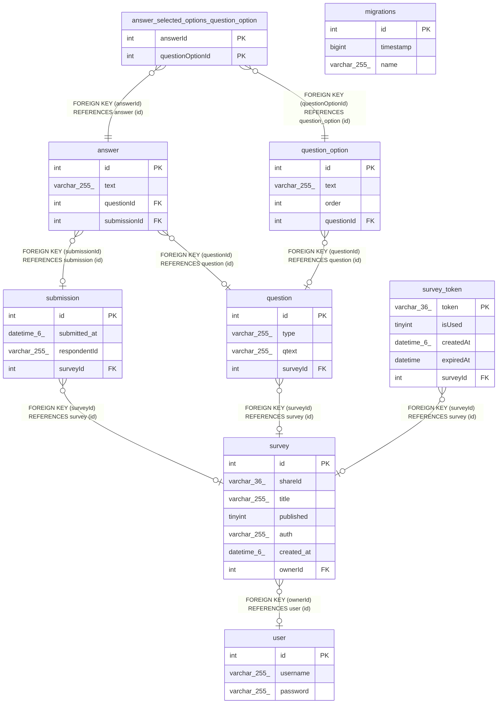

# survey_db

## Tables

| Name | Columns | Comment | Type |
| ---- | ------- | ------- | ---- |
| [answer](answer.md) | 4 |  | BASE TABLE |
| [answer_selected_options_question_option](answer_selected_options_question_option.md) | 2 |  | BASE TABLE |
| [migrations](migrations.md) | 3 |  | BASE TABLE |
| [question](question.md) | 4 |  | BASE TABLE |
| [question_option](question_option.md) | 4 |  | BASE TABLE |
| [submission](submission.md) | 4 |  | BASE TABLE |
| [survey](survey.md) | 7 |  | BASE TABLE |
| [survey_token](survey_token.md) | 5 |  | BASE TABLE |
| [user](user.md) | 3 |  | BASE TABLE |

## Relations

---

> Generated by [tbls](https://github.com/k1LoW/tbls)
