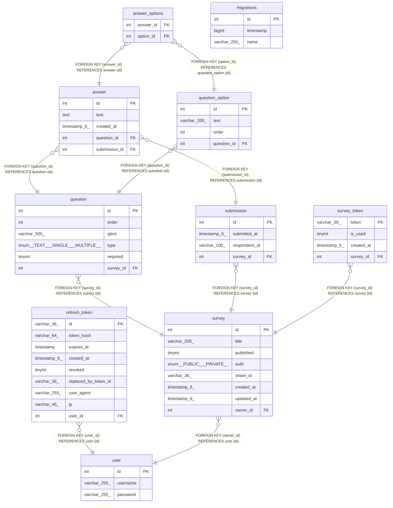

# survey_db

## Tables

| Name | Columns | Comment | Type |
| ---- | ------- | ------- | ---- |
| [answer](answer.md) | 5 |  | BASE TABLE |
| [answer_options](answer_options.md) | 2 |  | BASE TABLE |
| [migrations](migrations.md) | 3 |  | BASE TABLE |
| [question](question.md) | 6 |  | BASE TABLE |
| [question_option](question_option.md) | 4 |  | BASE TABLE |
| [refresh_token](refresh_token.md) | 9 |  | BASE TABLE |
| [submission](submission.md) | 4 |  | BASE TABLE |
| [survey](survey.md) | 8 |  | BASE TABLE |
| [survey_token](survey_token.md) | 4 |  | BASE TABLE |
| [user](user.md) | 3 |  | BASE TABLE |

## Relations

```mermaid
erDiagram

"answer" }o--|| "submission" : "FOREIGN KEY (submission_id) REFERENCES submission (id)"
"answer" }o--|| "question" : "FOREIGN KEY (question_id) REFERENCES question (id)"
"answer_options" }o--|| "question_option" : "FOREIGN KEY (option_id) REFERENCES question_option (id)"
"answer_options" }o--|| "answer" : "FOREIGN KEY (answer_id) REFERENCES answer (id)"
"question" }o--|| "survey" : "FOREIGN KEY (survey_id) REFERENCES survey (id)"
"question_option" }o--|| "question" : "FOREIGN KEY (question_id) REFERENCES question (id)"
"refresh_token" }o--|| "user" : "FOREIGN KEY (user_id) REFERENCES user (id)"
"submission" }o--|| "survey" : "FOREIGN KEY (survey_id) REFERENCES survey (id)"
"survey" }o--|| "user" : "FOREIGN KEY (owner_id) REFERENCES user (id)"
"survey_token" }o--|| "survey" : "FOREIGN KEY (survey_id) REFERENCES survey (id)"

"answer" {
  int id PK
  text text
  timestamp_6_ created_at
  int question_id FK
  int submission_id FK
}
"answer_options" {
  int answer_id PK
  int option_id PK
}
"migrations" {
  int id PK
  bigint timestamp
  varchar_255_ name
}
"question" {
  int id PK
  int order
  varchar_500_ qtext
  enum__TEXT___SINGLE___MULTIPLE__ type
  tinyint required
  int survey_id FK
}
"question_option" {
  int id PK
  varchar_200_ text
  int order
  int question_id FK
}
"refresh_token" {
  varchar_36_ id PK
  varchar_64_ token_hash
  timestamp expires_at
  timestamp_6_ created_at
  tinyint revoked
  varchar_36_ replaced_by_token_id
  varchar_255_ user_agent
  varchar_45_ ip
  int user_id FK
}
"submission" {
  int id PK
  timestamp_6_ submitted_at
  varchar_100_ respondent_id
  int survey_id FK
}
"survey" {
  int id PK
  varchar_200_ title
  tinyint published
  enum__PUBLIC___PRIVATE__ auth
  varchar_36_ share_id
  timestamp_6_ created_at
  timestamp_6_ updated_at
  int owner_id FK
}
"survey_token" {
  varchar_36_ token PK
  tinyint is_used
  timestamp_6_ created_at
  int survey_id FK
}
"user" {
  int id PK
  varchar_255_ username
  varchar_255_ password
}
```

---

> Generated by [tbls](https://github.com/k1LoW/tbls)
