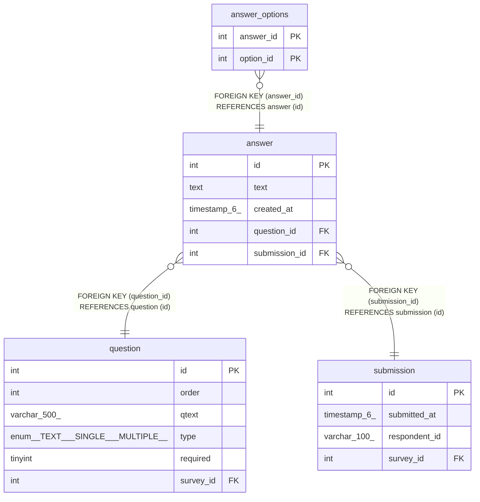

# answer

## Description

<details>
<summary><strong>Table Definition</strong></summary>

```sql
CREATE TABLE `answer` (
  `id` int NOT NULL AUTO_INCREMENT,
  `text` text,
  `created_at` timestamp(6) NOT NULL DEFAULT CURRENT_TIMESTAMP(6),
  `question_id` int NOT NULL,
  `submission_id` int NOT NULL,
  PRIMARY KEY (`id`),
  KEY `IDX_c3d19a89541e4f0813f2fe0919` (`question_id`),
  KEY `IDX_83373a8dab1b67c46bb813e86e` (`submission_id`),
  CONSTRAINT `FK_83373a8dab1b67c46bb813e86e1` FOREIGN KEY (`submission_id`) REFERENCES `submission` (`id`) ON DELETE CASCADE,
  CONSTRAINT `FK_c3d19a89541e4f0813f2fe09194` FOREIGN KEY (`question_id`) REFERENCES `question` (`id`) ON DELETE CASCADE
) ENGINE=InnoDB DEFAULT CHARSET=utf8mb4 COLLATE=utf8mb4_0900_ai_ci
```

</details>

## Columns

| Name | Type | Default | Nullable | Extra Definition | Children | Parents | Comment |
| ---- | ---- | ------- | -------- | ---------------- | -------- | ------- | ------- |
| id | int |  | false | auto_increment | [answer_options](answer_options.md) |  |  |
| text | text |  | true |  |  |  |  |
| created_at | timestamp(6) | CURRENT_TIMESTAMP(6) | false | DEFAULT_GENERATED |  |  |  |
| question_id | int |  | false |  |  | [question](question.md) |  |
| submission_id | int |  | false |  |  | [submission](submission.md) |  |

## Constraints

| Name | Type | Definition |
| ---- | ---- | ---------- |
| FK_83373a8dab1b67c46bb813e86e1 | FOREIGN KEY | FOREIGN KEY (submission_id) REFERENCES submission (id) |
| FK_c3d19a89541e4f0813f2fe09194 | FOREIGN KEY | FOREIGN KEY (question_id) REFERENCES question (id) |
| PRIMARY | PRIMARY KEY | PRIMARY KEY (id) |

## Indexes

| Name | Definition |
| ---- | ---------- |
| IDX_83373a8dab1b67c46bb813e86e | KEY IDX_83373a8dab1b67c46bb813e86e (submission_id) USING BTREE |
| IDX_c3d19a89541e4f0813f2fe0919 | KEY IDX_c3d19a89541e4f0813f2fe0919 (question_id) USING BTREE |
| PRIMARY | PRIMARY KEY (id) USING BTREE |

## Relations


```mermaid
erDiagram

"answer_options" }o--|| "answer" : "FOREIGN KEY (answer_id) REFERENCES answer (id)"
"answer" }o--|| "question" : "FOREIGN KEY (question_id) REFERENCES question (id)"
"answer" }o--|| "submission" : "FOREIGN KEY (submission_id) REFERENCES submission (id)"

"answer" {
  int id PK
  text text
  timestamp_6_ created_at
  int question_id FK
  int submission_id FK
}
"answer_options" {
  int answer_id PK
  int option_id PK
}
"question" {
  int id PK
  int order
  varchar_500_ qtext
  enum__TEXT___SINGLE___MULTIPLE__ type
  tinyint required
  int survey_id FK
}
"submission" {
  int id PK
  timestamp_6_ submitted_at
  varchar_100_ respondent_id
  int survey_id FK
}
```

---

> Generated by [tbls](https://github.com/k1LoW/tbls)
