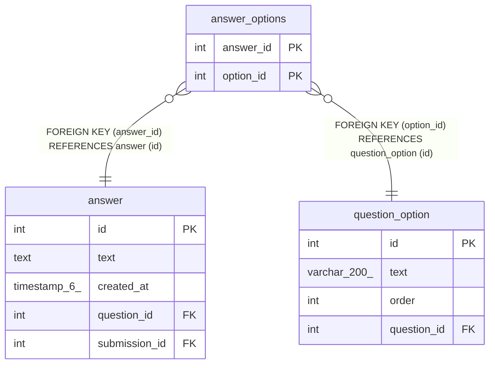

# answer_options

## Description

<details>
<summary><strong>Table Definition</strong></summary>

```sql
CREATE TABLE `answer_options` (
  `answer_id` int NOT NULL,
  `option_id` int NOT NULL,
  PRIMARY KEY (`answer_id`,`option_id`),
  KEY `IDX_c9e3904ebdcfc37c86dfcd3f9a` (`answer_id`),
  KEY `IDX_a471e2b4413da05fecea7b9e82` (`option_id`),
  CONSTRAINT `FK_a471e2b4413da05fecea7b9e828` FOREIGN KEY (`option_id`) REFERENCES `question_option` (`id`) ON DELETE CASCADE ON UPDATE CASCADE,
  CONSTRAINT `FK_c9e3904ebdcfc37c86dfcd3f9a3` FOREIGN KEY (`answer_id`) REFERENCES `answer` (`id`) ON DELETE CASCADE ON UPDATE CASCADE
) ENGINE=InnoDB DEFAULT CHARSET=utf8mb4 COLLATE=utf8mb4_0900_ai_ci
```

</details>

## Columns

| Name | Type | Default | Nullable | Children | Parents | Comment |
| ---- | ---- | ------- | -------- | -------- | ------- | ------- |
| answer_id | int |  | false |  | [answer](answer.md) |  |
| option_id | int |  | false |  | [question_option](question_option.md) |  |

## Constraints

| Name | Type | Definition |
| ---- | ---- | ---------- |
| FK_a471e2b4413da05fecea7b9e828 | FOREIGN KEY | FOREIGN KEY (option_id) REFERENCES question_option (id) |
| FK_c9e3904ebdcfc37c86dfcd3f9a3 | FOREIGN KEY | FOREIGN KEY (answer_id) REFERENCES answer (id) |
| PRIMARY | PRIMARY KEY | PRIMARY KEY (answer_id, option_id) |

## Indexes

| Name | Definition |
| ---- | ---------- |
| IDX_a471e2b4413da05fecea7b9e82 | KEY IDX_a471e2b4413da05fecea7b9e82 (option_id) USING BTREE |
| IDX_c9e3904ebdcfc37c86dfcd3f9a | KEY IDX_c9e3904ebdcfc37c86dfcd3f9a (answer_id) USING BTREE |
| PRIMARY | PRIMARY KEY (answer_id, option_id) USING BTREE |

## Relations



---

> Generated by [tbls](https://github.com/k1LoW/tbls)
