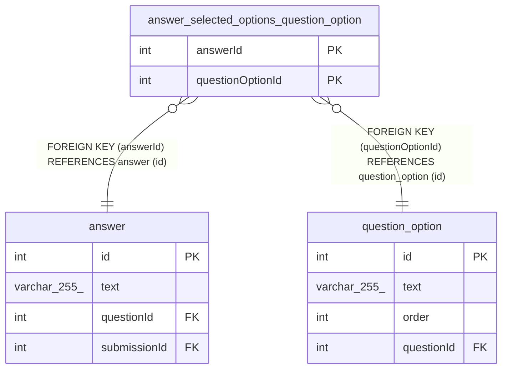

# answer_selected_options_question_option

## Description

<details>
<summary><strong>Table Definition</strong></summary>

```sql
CREATE TABLE `answer_selected_options_question_option` (
  `answerId` int NOT NULL,
  `questionOptionId` int NOT NULL,
  PRIMARY KEY (`answerId`,`questionOptionId`),
  KEY `IDX_7c36f35a3fcb6c5fe610023447` (`answerId`),
  KEY `IDX_a28062e701efff0f2680f6eafd` (`questionOptionId`),
  CONSTRAINT `FK_7c36f35a3fcb6c5fe6100234479` FOREIGN KEY (`answerId`) REFERENCES `answer` (`id`) ON DELETE CASCADE ON UPDATE CASCADE,
  CONSTRAINT `FK_a28062e701efff0f2680f6eafd1` FOREIGN KEY (`questionOptionId`) REFERENCES `question_option` (`id`) ON DELETE CASCADE ON UPDATE CASCADE
) ENGINE=InnoDB DEFAULT CHARSET=utf8mb4 COLLATE=utf8mb4_0900_ai_ci
```

</details>

## Columns

| Name | Type | Default | Nullable | Children | Parents | Comment |
| ---- | ---- | ------- | -------- | -------- | ------- | ------- |
| answerId | int |  | false |  | [answer](answer.md) |  |
| questionOptionId | int |  | false |  | [question_option](question_option.md) |  |

## Constraints

| Name | Type | Definition |
| ---- | ---- | ---------- |
| FK_7c36f35a3fcb6c5fe6100234479 | FOREIGN KEY | FOREIGN KEY (answerId) REFERENCES answer (id) |
| FK_a28062e701efff0f2680f6eafd1 | FOREIGN KEY | FOREIGN KEY (questionOptionId) REFERENCES question_option (id) |
| PRIMARY | PRIMARY KEY | PRIMARY KEY (answerId, questionOptionId) |

## Indexes

| Name | Definition |
| ---- | ---------- |
| IDX_7c36f35a3fcb6c5fe610023447 | KEY IDX_7c36f35a3fcb6c5fe610023447 (answerId) USING BTREE |
| IDX_a28062e701efff0f2680f6eafd | KEY IDX_a28062e701efff0f2680f6eafd (questionOptionId) USING BTREE |
| PRIMARY | PRIMARY KEY (answerId, questionOptionId) USING BTREE |

## Relations



---

> Generated by [tbls](https://github.com/k1LoW/tbls)
