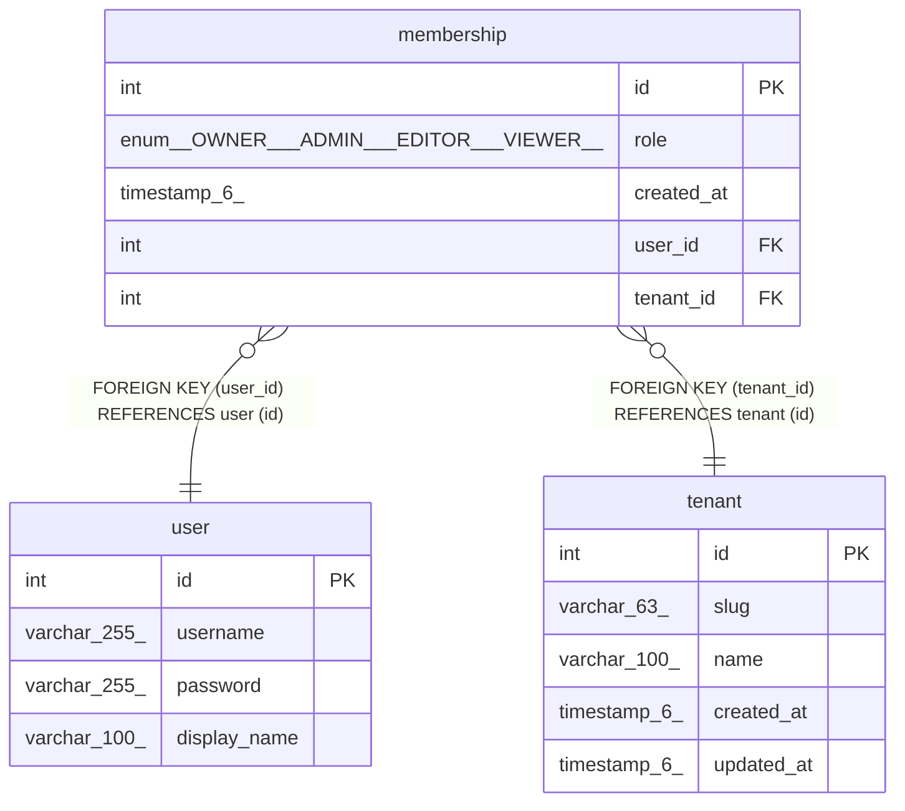

# membership

## Description

<details>
<summary><strong>Table Definition</strong></summary>

```sql
CREATE TABLE `membership` (
  `id` int NOT NULL AUTO_INCREMENT,
  `role` enum('OWNER','ADMIN','EDITOR','VIEWER') NOT NULL,
  `created_at` timestamp(6) NOT NULL DEFAULT CURRENT_TIMESTAMP(6),
  `user_id` int NOT NULL,
  `tenant_id` int NOT NULL,
  PRIMARY KEY (`id`),
  UNIQUE KEY `IDX_f3da6dbeb0a5f3e83450045d59` (`user_id`,`tenant_id`),
  KEY `FK_ccc7d9df9ca83f3a0cbc4686086` (`tenant_id`),
  CONSTRAINT `FK_ccc7d9df9ca83f3a0cbc4686086` FOREIGN KEY (`tenant_id`) REFERENCES `tenant` (`id`) ON DELETE CASCADE,
  CONSTRAINT `FK_e9c72e8d29784031c96f5c6af8d` FOREIGN KEY (`user_id`) REFERENCES `user` (`id`) ON DELETE CASCADE
) ENGINE=InnoDB DEFAULT CHARSET=utf8mb4 COLLATE=utf8mb4_0900_ai_ci
```

</details>

## Columns

| Name | Type | Default | Nullable | Extra Definition | Children | Parents | Comment |
| ---- | ---- | ------- | -------- | ---------------- | -------- | ------- | ------- |
| id | int |  | false | auto_increment |  |  |  |
| role | enum('OWNER','ADMIN','EDITOR','VIEWER') |  | false |  |  |  |  |
| created_at | timestamp(6) | CURRENT_TIMESTAMP(6) | false | DEFAULT_GENERATED |  |  |  |
| user_id | int |  | false |  |  | [user](user.md) |  |
| tenant_id | int |  | false |  |  | [tenant](tenant.md) |  |

## Constraints

| Name | Type | Definition |
| ---- | ---- | ---------- |
| FK_ccc7d9df9ca83f3a0cbc4686086 | FOREIGN KEY | FOREIGN KEY (tenant_id) REFERENCES tenant (id) |
| FK_e9c72e8d29784031c96f5c6af8d | FOREIGN KEY | FOREIGN KEY (user_id) REFERENCES user (id) |
| IDX_f3da6dbeb0a5f3e83450045d59 | UNIQUE | UNIQUE KEY IDX_f3da6dbeb0a5f3e83450045d59 (user_id, tenant_id) |
| PRIMARY | PRIMARY KEY | PRIMARY KEY (id) |

## Indexes

| Name | Definition |
| ---- | ---------- |
| FK_ccc7d9df9ca83f3a0cbc4686086 | KEY FK_ccc7d9df9ca83f3a0cbc4686086 (tenant_id) USING BTREE |
| PRIMARY | PRIMARY KEY (id) USING BTREE |
| IDX_f3da6dbeb0a5f3e83450045d59 | UNIQUE KEY IDX_f3da6dbeb0a5f3e83450045d59 (user_id, tenant_id) USING BTREE |

## Relations



---

> Generated by [tbls](https://github.com/k1LoW/tbls)
