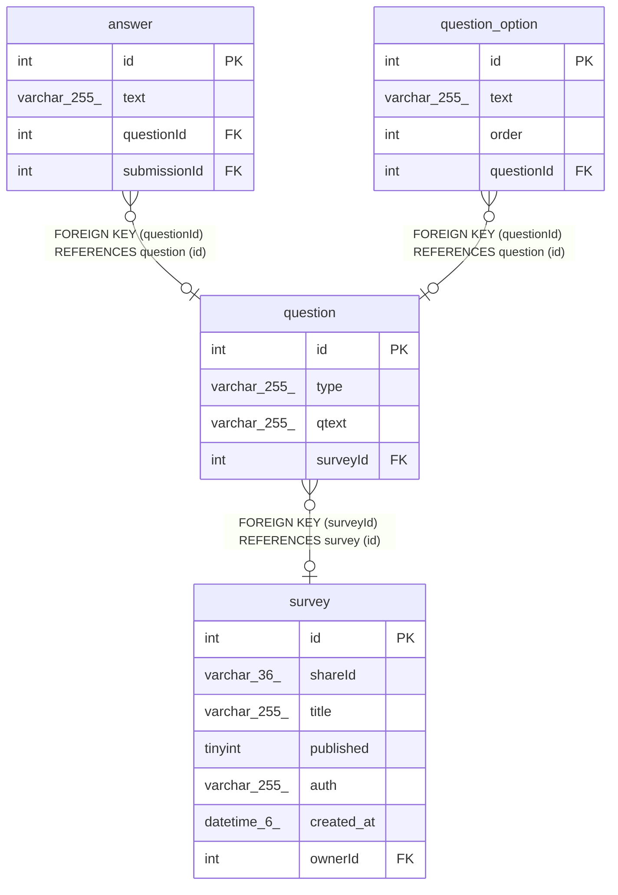

# question

## Description

<details>
<summary><strong>Table Definition</strong></summary>

```sql
CREATE TABLE `question` (
  `id` int NOT NULL AUTO_INCREMENT,
  `type` varchar(255) NOT NULL DEFAULT 'TEXT',
  `qtext` varchar(255) NOT NULL,
  `surveyId` int DEFAULT NULL,
  PRIMARY KEY (`id`),
  KEY `FK_a1188e0f702ab268e0982049e5c` (`surveyId`),
  CONSTRAINT `FK_a1188e0f702ab268e0982049e5c` FOREIGN KEY (`surveyId`) REFERENCES `survey` (`id`) ON DELETE CASCADE
) ENGINE=InnoDB AUTO_INCREMENT=[Redacted by tbls] DEFAULT CHARSET=utf8mb4 COLLATE=utf8mb4_0900_ai_ci
```

</details>

## Columns

| Name | Type | Default | Nullable | Extra Definition | Children | Parents | Comment |
| ---- | ---- | ------- | -------- | ---------------- | -------- | ------- | ------- |
| id | int |  | false | auto_increment | [answer](answer.md) [question_option](question_option.md) |  |  |
| type | varchar(255) | TEXT | false |  |  |  |  |
| qtext | varchar(255) |  | false |  |  |  |  |
| surveyId | int |  | true |  |  | [survey](survey.md) |  |

## Constraints

| Name | Type | Definition |
| ---- | ---- | ---------- |
| FK_a1188e0f702ab268e0982049e5c | FOREIGN KEY | FOREIGN KEY (surveyId) REFERENCES survey (id) |
| PRIMARY | PRIMARY KEY | PRIMARY KEY (id) |

## Indexes

| Name | Definition |
| ---- | ---------- |
| FK_a1188e0f702ab268e0982049e5c | KEY FK_a1188e0f702ab268e0982049e5c (surveyId) USING BTREE |
| PRIMARY | PRIMARY KEY (id) USING BTREE |

## Relations



---

> Generated by [tbls](https://github.com/k1LoW/tbls)
