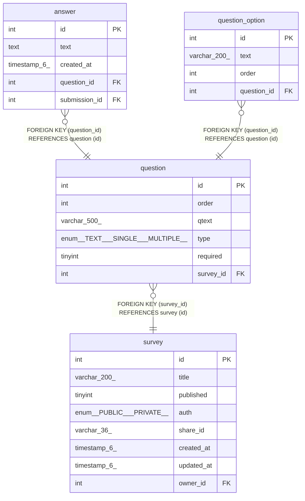

# question

## Description

<details>
<summary><strong>Table Definition</strong></summary>

```sql
CREATE TABLE `question` (
  `id` int NOT NULL AUTO_INCREMENT,
  `order` int NOT NULL,
  `qtext` varchar(500) NOT NULL,
  `type` enum('TEXT','SINGLE','MULTIPLE') NOT NULL,
  `required` tinyint NOT NULL DEFAULT '0',
  `survey_id` int NOT NULL,
  PRIMARY KEY (`id`),
  KEY `IDX_b38a3cdf1ccc1098f2d8757bd8` (`survey_id`,`order`),
  CONSTRAINT `FK_a74e5e8dfbf68d7d1cd39c8c9fc` FOREIGN KEY (`survey_id`) REFERENCES `survey` (`id`) ON DELETE CASCADE
) ENGINE=InnoDB DEFAULT CHARSET=utf8mb4 COLLATE=utf8mb4_0900_ai_ci
```

</details>

## Columns

| Name | Type | Default | Nullable | Extra Definition | Children | Parents | Comment |
| ---- | ---- | ------- | -------- | ---------------- | -------- | ------- | ------- |
| id | int |  | false | auto_increment | [answer](answer.md) [question_option](question_option.md) |  |  |
| order | int |  | false |  |  |  |  |
| qtext | varchar(500) |  | false |  |  |  |  |
| type | enum('TEXT','SINGLE','MULTIPLE') |  | false |  |  |  |  |
| required | tinyint | 0 | false |  |  |  |  |
| survey_id | int |  | false |  |  | [survey](survey.md) |  |

## Constraints

| Name | Type | Definition |
| ---- | ---- | ---------- |
| FK_a74e5e8dfbf68d7d1cd39c8c9fc | FOREIGN KEY | FOREIGN KEY (survey_id) REFERENCES survey (id) |
| PRIMARY | PRIMARY KEY | PRIMARY KEY (id) |

## Indexes

| Name | Definition |
| ---- | ---------- |
| IDX_b38a3cdf1ccc1098f2d8757bd8 | KEY IDX_b38a3cdf1ccc1098f2d8757bd8 (survey_id, order) USING BTREE |
| PRIMARY | PRIMARY KEY (id) USING BTREE |

## Relations


```mermaid
erDiagram

"answer" }o--|| "question" : "FOREIGN KEY (question_id) REFERENCES question (id)"
"question_option" }o--|| "question" : "FOREIGN KEY (question_id) REFERENCES question (id)"
"question" }o--|| "survey" : "FOREIGN KEY (survey_id) REFERENCES survey (id)"

"question" {
  int id PK
  int order
  varchar_500_ qtext
  enum__TEXT___SINGLE___MULTIPLE__ type
  tinyint required
  int survey_id FK
}
"answer" {
  int id PK
  text text
  timestamp_6_ created_at
  int question_id FK
  int submission_id FK
}
"question_option" {
  int id PK
  varchar_200_ text
  int order
  int question_id FK
}
"survey" {
  int id PK
  varchar_200_ title
  tinyint published
  enum__PUBLIC___PRIVATE__ auth
  varchar_36_ share_id
  timestamp_6_ created_at
  timestamp_6_ updated_at
  int owner_id FK
}
```

---

> Generated by [tbls](https://github.com/k1LoW/tbls)
