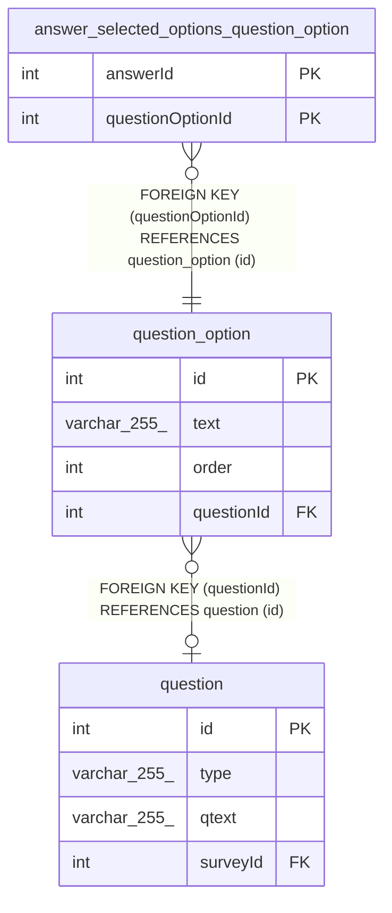

# question_option

## Description

<details>
<summary><strong>Table Definition</strong></summary>

```sql
CREATE TABLE `question_option` (
  `id` int NOT NULL AUTO_INCREMENT,
  `text` varchar(255) NOT NULL,
  `order` int NOT NULL DEFAULT '0',
  `questionId` int DEFAULT NULL,
  PRIMARY KEY (`id`),
  KEY `FK_ba19747af180520381a117f5986` (`questionId`),
  CONSTRAINT `FK_ba19747af180520381a117f5986` FOREIGN KEY (`questionId`) REFERENCES `question` (`id`)
) ENGINE=InnoDB DEFAULT CHARSET=utf8mb4 COLLATE=utf8mb4_0900_ai_ci
```

</details>

## Columns

| Name | Type | Default | Nullable | Extra Definition | Children | Parents | Comment |
| ---- | ---- | ------- | -------- | ---------------- | -------- | ------- | ------- |
| id | int |  | false | auto_increment | [answer_selected_options_question_option](answer_selected_options_question_option.md) |  |  |
| text | varchar(255) |  | false |  |  |  |  |
| order | int | 0 | false |  |  |  |  |
| questionId | int |  | true |  |  | [question](question.md) |  |

## Constraints

| Name | Type | Definition |
| ---- | ---- | ---------- |
| FK_ba19747af180520381a117f5986 | FOREIGN KEY | FOREIGN KEY (questionId) REFERENCES question (id) |
| PRIMARY | PRIMARY KEY | PRIMARY KEY (id) |

## Indexes

| Name | Definition |
| ---- | ---------- |
| FK_ba19747af180520381a117f5986 | KEY FK_ba19747af180520381a117f5986 (questionId) USING BTREE |
| PRIMARY | PRIMARY KEY (id) USING BTREE |

## Relations



---

> Generated by [tbls](https://github.com/k1LoW/tbls)
