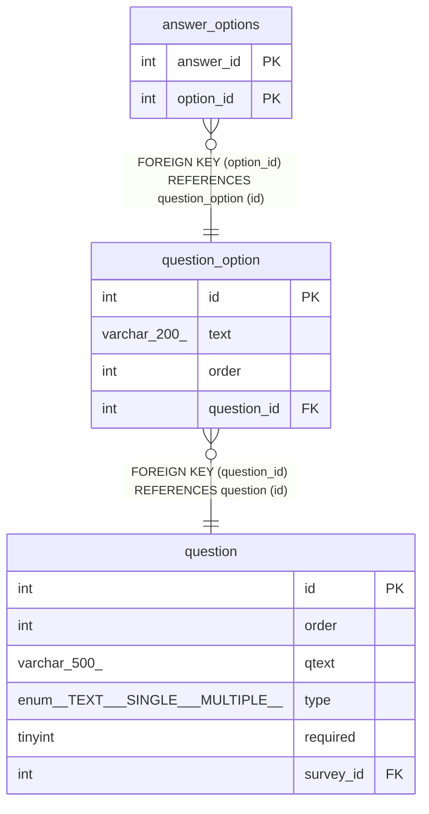

# question_option

## Description

<details>
<summary><strong>Table Definition</strong></summary>

```sql
CREATE TABLE `question_option` (
  `id` int NOT NULL AUTO_INCREMENT,
  `text` varchar(200) NOT NULL,
  `order` int NOT NULL,
  `question_id` int NOT NULL,
  PRIMARY KEY (`id`),
  KEY `IDX_6aaa48b4788f7f99210d3bce92` (`question_id`,`order`),
  CONSTRAINT `FK_747190c37a39feced5efcbb303f` FOREIGN KEY (`question_id`) REFERENCES `question` (`id`) ON DELETE CASCADE
) ENGINE=InnoDB DEFAULT CHARSET=utf8mb4 COLLATE=utf8mb4_0900_ai_ci
```

</details>

## Columns

| Name | Type | Default | Nullable | Extra Definition | Children | Parents | Comment |
| ---- | ---- | ------- | -------- | ---------------- | -------- | ------- | ------- |
| id | int |  | false | auto_increment | [answer_options](answer_options.md) |  |  |
| text | varchar(200) |  | false |  |  |  |  |
| order | int |  | false |  |  |  |  |
| question_id | int |  | false |  |  | [question](question.md) |  |

## Constraints

| Name | Type | Definition |
| ---- | ---- | ---------- |
| FK_747190c37a39feced5efcbb303f | FOREIGN KEY | FOREIGN KEY (question_id) REFERENCES question (id) |
| PRIMARY | PRIMARY KEY | PRIMARY KEY (id) |

## Indexes

| Name | Definition |
| ---- | ---------- |
| IDX_6aaa48b4788f7f99210d3bce92 | KEY IDX_6aaa48b4788f7f99210d3bce92 (question_id, order) USING BTREE |
| PRIMARY | PRIMARY KEY (id) USING BTREE |

## Relations


```mermaid
erDiagram

"answer_options" }o--|| "question_option" : "FOREIGN KEY (option_id) REFERENCES question_option (id)"
"question_option" }o--|| "question" : "FOREIGN KEY (question_id) REFERENCES question (id)"

"question_option" {
  int id PK
  varchar_200_ text
  int order
  int question_id FK
}
"answer_options" {
  int answer_id PK
  int option_id PK
}
"question" {
  int id PK
  int order
  varchar_500_ qtext
  enum__TEXT___SINGLE___MULTIPLE__ type
  tinyint required
  int survey_id FK
}
```

---

> Generated by [tbls](https://github.com/k1LoW/tbls)
