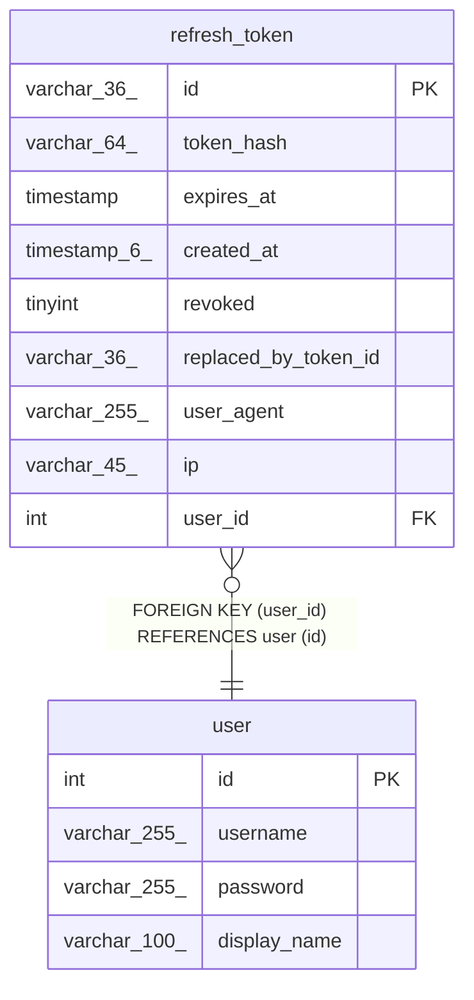

# refresh_token

## Description

<details>
<summary><strong>Table Definition</strong></summary>

```sql
CREATE TABLE `refresh_token` (
  `id` varchar(36) NOT NULL,
  `token_hash` varchar(64) NOT NULL,
  `expires_at` timestamp NOT NULL,
  `created_at` timestamp(6) NOT NULL DEFAULT CURRENT_TIMESTAMP(6),
  `revoked` tinyint NOT NULL DEFAULT '0',
  `replaced_by_token_id` varchar(36) DEFAULT NULL,
  `user_agent` varchar(255) DEFAULT NULL,
  `ip` varchar(45) DEFAULT NULL,
  `user_id` int NOT NULL,
  PRIMARY KEY (`id`),
  UNIQUE KEY `IDX_f0812282fad2e352cdaf83ef0a` (`token_hash`),
  KEY `FK_6bbe63d2fe75e7f0ba1710351d4` (`user_id`),
  CONSTRAINT `FK_6bbe63d2fe75e7f0ba1710351d4` FOREIGN KEY (`user_id`) REFERENCES `user` (`id`) ON DELETE CASCADE
) ENGINE=InnoDB DEFAULT CHARSET=utf8mb4 COLLATE=utf8mb4_0900_ai_ci
```

</details>

## Columns

| Name | Type | Default | Nullable | Extra Definition | Children | Parents | Comment |
| ---- | ---- | ------- | -------- | ---------------- | -------- | ------- | ------- |
| id | varchar(36) |  | false |  |  |  |  |
| token_hash | varchar(64) |  | false |  |  |  |  |
| expires_at | timestamp |  | false |  |  |  |  |
| created_at | timestamp(6) | CURRENT_TIMESTAMP(6) | false | DEFAULT_GENERATED |  |  |  |
| revoked | tinyint | 0 | false |  |  |  |  |
| replaced_by_token_id | varchar(36) |  | true |  |  |  |  |
| user_agent | varchar(255) |  | true |  |  |  |  |
| ip | varchar(45) |  | true |  |  |  |  |
| user_id | int |  | false |  |  | [user](user.md) |  |

## Constraints

| Name | Type | Definition |
| ---- | ---- | ---------- |
| FK_6bbe63d2fe75e7f0ba1710351d4 | FOREIGN KEY | FOREIGN KEY (user_id) REFERENCES user (id) |
| IDX_f0812282fad2e352cdaf83ef0a | UNIQUE | UNIQUE KEY IDX_f0812282fad2e352cdaf83ef0a (token_hash) |
| PRIMARY | PRIMARY KEY | PRIMARY KEY (id) |

## Indexes

| Name | Definition |
| ---- | ---------- |
| FK_6bbe63d2fe75e7f0ba1710351d4 | KEY FK_6bbe63d2fe75e7f0ba1710351d4 (user_id) USING BTREE |
| PRIMARY | PRIMARY KEY (id) USING BTREE |
| IDX_f0812282fad2e352cdaf83ef0a | UNIQUE KEY IDX_f0812282fad2e352cdaf83ef0a (token_hash) USING BTREE |

## Relations



---

> Generated by [tbls](https://github.com/k1LoW/tbls)
