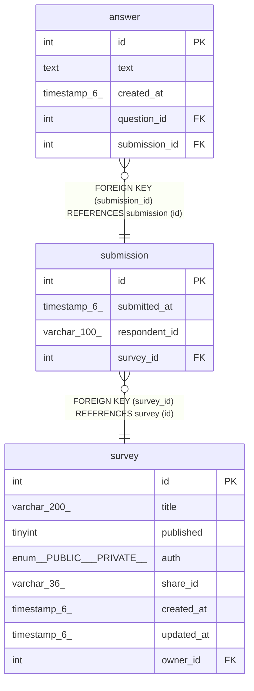

# submission

## Description

<details>
<summary><strong>Table Definition</strong></summary>

```sql
CREATE TABLE `submission` (
  `id` int NOT NULL AUTO_INCREMENT,
  `submitted_at` timestamp(6) NOT NULL DEFAULT CURRENT_TIMESTAMP(6),
  `respondent_id` varchar(100) DEFAULT NULL,
  `survey_id` int NOT NULL,
  PRIMARY KEY (`id`),
  KEY `IDX_a7cb7a8716f01cc5f73ccbc594` (`survey_id`),
  CONSTRAINT `FK_a7cb7a8716f01cc5f73ccbc5946` FOREIGN KEY (`survey_id`) REFERENCES `survey` (`id`) ON DELETE CASCADE
) ENGINE=InnoDB DEFAULT CHARSET=utf8mb4 COLLATE=utf8mb4_0900_ai_ci
```

</details>

## Columns

| Name | Type | Default | Nullable | Extra Definition | Children | Parents | Comment |
| ---- | ---- | ------- | -------- | ---------------- | -------- | ------- | ------- |
| id | int |  | false | auto_increment | [answer](answer.md) |  |  |
| submitted_at | timestamp(6) | CURRENT_TIMESTAMP(6) | false | DEFAULT_GENERATED |  |  |  |
| respondent_id | varchar(100) |  | true |  |  |  |  |
| survey_id | int |  | false |  |  | [survey](survey.md) |  |

## Constraints

| Name | Type | Definition |
| ---- | ---- | ---------- |
| FK_a7cb7a8716f01cc5f73ccbc5946 | FOREIGN KEY | FOREIGN KEY (survey_id) REFERENCES survey (id) |
| PRIMARY | PRIMARY KEY | PRIMARY KEY (id) |

## Indexes

| Name | Definition |
| ---- | ---------- |
| IDX_a7cb7a8716f01cc5f73ccbc594 | KEY IDX_a7cb7a8716f01cc5f73ccbc594 (survey_id) USING BTREE |
| PRIMARY | PRIMARY KEY (id) USING BTREE |

## Relations


```mermaid
erDiagram

"answer" }o--|| "submission" : "FOREIGN KEY (submission_id) REFERENCES submission (id)"
"submission" }o--|| "survey" : "FOREIGN KEY (survey_id) REFERENCES survey (id)"

"submission" {
  int id PK
  timestamp_6_ submitted_at
  varchar_100_ respondent_id
  int survey_id FK
}
"answer" {
  int id PK
  text text
  timestamp_6_ created_at
  int question_id FK
  int submission_id FK
}
"survey" {
  int id PK
  varchar_200_ title
  tinyint published
  enum__PUBLIC___PRIVATE__ auth
  varchar_36_ share_id
  timestamp_6_ created_at
  timestamp_6_ updated_at
  int owner_id FK
}
```

---

> Generated by [tbls](https://github.com/k1LoW/tbls)
