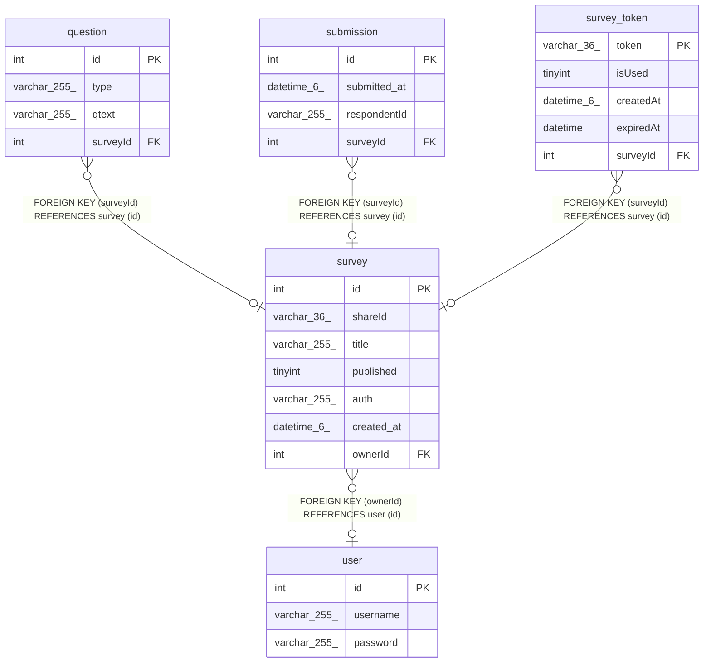

# survey

## Description

<details>
<summary><strong>Table Definition</strong></summary>

```sql
CREATE TABLE `survey` (
  `id` int NOT NULL AUTO_INCREMENT,
  `shareId` varchar(36) NOT NULL,
  `title` varchar(255) NOT NULL,
  `published` tinyint NOT NULL DEFAULT '0',
  `auth` varchar(255) NOT NULL DEFAULT '0',
  `created_at` datetime(6) NOT NULL DEFAULT CURRENT_TIMESTAMP(6),
  `ownerId` int DEFAULT NULL,
  PRIMARY KEY (`id`),
  UNIQUE KEY `IDX_76268d52f6deafc75cb9987c21` (`shareId`),
  KEY `FK_a2e6e9ab8f1ff04cbf31da646e7` (`ownerId`),
  CONSTRAINT `FK_a2e6e9ab8f1ff04cbf31da646e7` FOREIGN KEY (`ownerId`) REFERENCES `user` (`id`)
) ENGINE=InnoDB AUTO_INCREMENT=[Redacted by tbls] DEFAULT CHARSET=utf8mb4 COLLATE=utf8mb4_0900_ai_ci
```

</details>

## Columns

| Name | Type | Default | Nullable | Extra Definition | Children | Parents | Comment |
| ---- | ---- | ------- | -------- | ---------------- | -------- | ------- | ------- |
| id | int |  | false | auto_increment | [question](question.md) [submission](submission.md) [survey_token](survey_token.md) |  |  |
| shareId | varchar(36) |  | false |  |  |  |  |
| title | varchar(255) |  | false |  |  |  |  |
| published | tinyint | 0 | false |  |  |  |  |
| auth | varchar(255) | 0 | false |  |  |  |  |
| created_at | datetime(6) | CURRENT_TIMESTAMP(6) | false | DEFAULT_GENERATED |  |  |  |
| ownerId | int |  | true |  |  | [user](user.md) |  |

## Constraints

| Name | Type | Definition |
| ---- | ---- | ---------- |
| FK_a2e6e9ab8f1ff04cbf31da646e7 | FOREIGN KEY | FOREIGN KEY (ownerId) REFERENCES user (id) |
| IDX_76268d52f6deafc75cb9987c21 | UNIQUE | UNIQUE KEY IDX_76268d52f6deafc75cb9987c21 (shareId) |
| PRIMARY | PRIMARY KEY | PRIMARY KEY (id) |

## Indexes

| Name | Definition |
| ---- | ---------- |
| FK_a2e6e9ab8f1ff04cbf31da646e7 | KEY FK_a2e6e9ab8f1ff04cbf31da646e7 (ownerId) USING BTREE |
| PRIMARY | PRIMARY KEY (id) USING BTREE |
| IDX_76268d52f6deafc75cb9987c21 | UNIQUE KEY IDX_76268d52f6deafc75cb9987c21 (shareId) USING BTREE |

## Relations



---

> Generated by [tbls](https://github.com/k1LoW/tbls)
