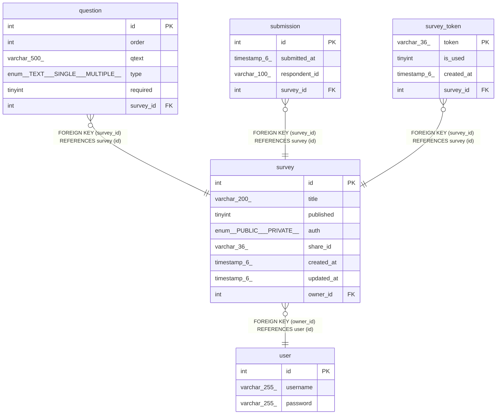

# survey

## Description

<details>
<summary><strong>Table Definition</strong></summary>

```sql
CREATE TABLE `survey` (
  `id` int NOT NULL AUTO_INCREMENT,
  `title` varchar(200) NOT NULL,
  `published` tinyint NOT NULL DEFAULT '0',
  `auth` enum('PUBLIC','PRIVATE') NOT NULL DEFAULT 'PUBLIC',
  `share_id` varchar(36) NOT NULL,
  `created_at` timestamp(6) NOT NULL DEFAULT CURRENT_TIMESTAMP(6),
  `updated_at` timestamp(6) NOT NULL DEFAULT CURRENT_TIMESTAMP(6) ON UPDATE CURRENT_TIMESTAMP(6),
  `owner_id` int NOT NULL,
  PRIMARY KEY (`id`),
  UNIQUE KEY `IDX_5294383ae2244a90612a681883` (`share_id`),
  KEY `IDX_ec8daff33708a5bc68df09e8fe` (`owner_id`),
  CONSTRAINT `FK_ec8daff33708a5bc68df09e8fe5` FOREIGN KEY (`owner_id`) REFERENCES `user` (`id`) ON DELETE CASCADE
) ENGINE=InnoDB DEFAULT CHARSET=utf8mb4 COLLATE=utf8mb4_0900_ai_ci
```

</details>

## Columns

| Name | Type | Default | Nullable | Extra Definition | Children | Parents | Comment |
| ---- | ---- | ------- | -------- | ---------------- | -------- | ------- | ------- |
| id | int |  | false | auto_increment | [question](question.md) [submission](submission.md) [survey_token](survey_token.md) |  |  |
| title | varchar(200) |  | false |  |  |  |  |
| published | tinyint | 0 | false |  |  |  |  |
| auth | enum('PUBLIC','PRIVATE') | PUBLIC | false |  |  |  |  |
| share_id | varchar(36) |  | false |  |  |  |  |
| created_at | timestamp(6) | CURRENT_TIMESTAMP(6) | false | DEFAULT_GENERATED |  |  |  |
| updated_at | timestamp(6) | CURRENT_TIMESTAMP(6) | false | DEFAULT_GENERATED on update CURRENT_TIMESTAMP(6) |  |  |  |
| owner_id | int |  | false |  |  | [user](user.md) |  |

## Constraints

| Name | Type | Definition |
| ---- | ---- | ---------- |
| FK_ec8daff33708a5bc68df09e8fe5 | FOREIGN KEY | FOREIGN KEY (owner_id) REFERENCES user (id) |
| IDX_5294383ae2244a90612a681883 | UNIQUE | UNIQUE KEY IDX_5294383ae2244a90612a681883 (share_id) |
| PRIMARY | PRIMARY KEY | PRIMARY KEY (id) |

## Indexes

| Name | Definition |
| ---- | ---------- |
| IDX_ec8daff33708a5bc68df09e8fe | KEY IDX_ec8daff33708a5bc68df09e8fe (owner_id) USING BTREE |
| PRIMARY | PRIMARY KEY (id) USING BTREE |
| IDX_5294383ae2244a90612a681883 | UNIQUE KEY IDX_5294383ae2244a90612a681883 (share_id) USING BTREE |

## Relations


```mermaid
erDiagram

"question" }o--|| "survey" : "FOREIGN KEY (survey_id) REFERENCES survey (id)"
"submission" }o--|| "survey" : "FOREIGN KEY (survey_id) REFERENCES survey (id)"
"survey_token" }o--|| "survey" : "FOREIGN KEY (survey_id) REFERENCES survey (id)"
"survey" }o--|| "user" : "FOREIGN KEY (owner_id) REFERENCES user (id)"

"survey" {
  int id PK
  varchar_200_ title
  tinyint published
  enum__PUBLIC___PRIVATE__ auth
  varchar_36_ share_id
  timestamp_6_ created_at
  timestamp_6_ updated_at
  int owner_id FK
}
"question" {
  int id PK
  int order
  varchar_500_ qtext
  enum__TEXT___SINGLE___MULTIPLE__ type
  tinyint required
  int survey_id FK
}
"submission" {
  int id PK
  timestamp_6_ submitted_at
  varchar_100_ respondent_id
  int survey_id FK
}
"survey_token" {
  varchar_36_ token PK
  tinyint is_used
  timestamp_6_ created_at
  int survey_id FK
}
"user" {
  int id PK
  varchar_255_ username
  varchar_255_ password
}
```

---

> Generated by [tbls](https://github.com/k1LoW/tbls)
