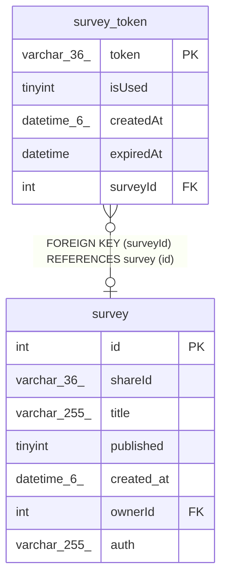

# survey_token

## Description

<details>
<summary><strong>Table Definition</strong></summary>

```sql
CREATE TABLE `survey_token` (
  `token` varchar(36) NOT NULL,
  `isUsed` tinyint NOT NULL DEFAULT '0',
  `createdAt` datetime(6) NOT NULL DEFAULT CURRENT_TIMESTAMP(6),
  `expiredAt` datetime DEFAULT NULL,
  `surveyId` int DEFAULT NULL,
  PRIMARY KEY (`token`),
  KEY `FK_beeccb051103b4b15ee1ca81547` (`surveyId`),
  CONSTRAINT `FK_beeccb051103b4b15ee1ca81547` FOREIGN KEY (`surveyId`) REFERENCES `survey` (`id`) ON DELETE CASCADE
) ENGINE=InnoDB DEFAULT CHARSET=utf8mb4 COLLATE=utf8mb4_0900_ai_ci
```

</details>

## Columns

| Name | Type | Default | Nullable | Extra Definition | Children | Parents | Comment |
| ---- | ---- | ------- | -------- | ---------------- | -------- | ------- | ------- |
| token | varchar(36) |  | false |  |  |  |  |
| isUsed | tinyint | 0 | false |  |  |  |  |
| createdAt | datetime(6) | CURRENT_TIMESTAMP(6) | false | DEFAULT_GENERATED |  |  |  |
| expiredAt | datetime |  | true |  |  |  |  |
| surveyId | int |  | true |  |  | [survey](survey.md) |  |

## Constraints

| Name | Type | Definition |
| ---- | ---- | ---------- |
| FK_beeccb051103b4b15ee1ca81547 | FOREIGN KEY | FOREIGN KEY (surveyId) REFERENCES survey (id) |
| PRIMARY | PRIMARY KEY | PRIMARY KEY (token) |

## Indexes

| Name | Definition |
| ---- | ---------- |
| FK_beeccb051103b4b15ee1ca81547 | KEY FK_beeccb051103b4b15ee1ca81547 (surveyId) USING BTREE |
| PRIMARY | PRIMARY KEY (token) USING BTREE |

## Relations



---

> Generated by [tbls](https://github.com/k1LoW/tbls)
