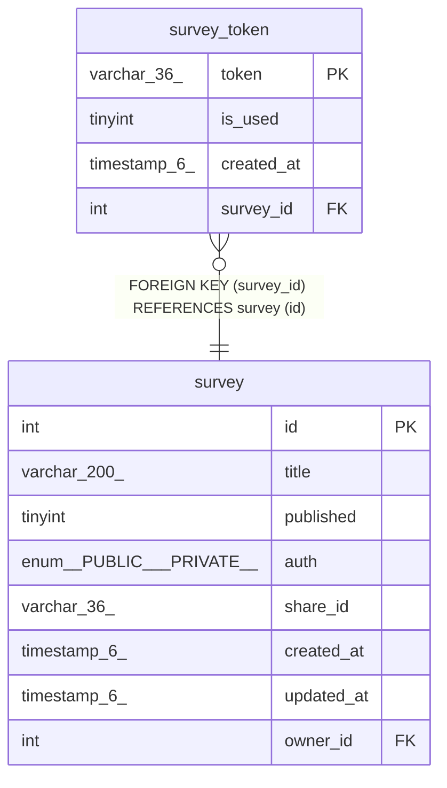

# survey_token

## Description

<details>
<summary><strong>Table Definition</strong></summary>

```sql
CREATE TABLE `survey_token` (
  `token` varchar(36) NOT NULL,
  `is_used` tinyint NOT NULL DEFAULT '0',
  `created_at` timestamp(6) NOT NULL DEFAULT CURRENT_TIMESTAMP(6),
  `survey_id` int NOT NULL,
  PRIMARY KEY (`token`),
  KEY `IDX_fc20e76ece85282732bc26223b` (`is_used`),
  KEY `IDX_367730178794cb6266d0c08500` (`survey_id`),
  CONSTRAINT `FK_367730178794cb6266d0c08500d` FOREIGN KEY (`survey_id`) REFERENCES `survey` (`id`) ON DELETE CASCADE
) ENGINE=InnoDB DEFAULT CHARSET=utf8mb4 COLLATE=utf8mb4_0900_ai_ci
```

</details>

## Columns

| Name | Type | Default | Nullable | Extra Definition | Children | Parents | Comment |
| ---- | ---- | ------- | -------- | ---------------- | -------- | ------- | ------- |
| token | varchar(36) |  | false |  |  |  |  |
| is_used | tinyint | 0 | false |  |  |  |  |
| created_at | timestamp(6) | CURRENT_TIMESTAMP(6) | false | DEFAULT_GENERATED |  |  |  |
| survey_id | int |  | false |  |  | [survey](survey.md) |  |

## Constraints

| Name | Type | Definition |
| ---- | ---- | ---------- |
| FK_367730178794cb6266d0c08500d | FOREIGN KEY | FOREIGN KEY (survey_id) REFERENCES survey (id) |
| PRIMARY | PRIMARY KEY | PRIMARY KEY (token) |

## Indexes

| Name | Definition |
| ---- | ---------- |
| IDX_367730178794cb6266d0c08500 | KEY IDX_367730178794cb6266d0c08500 (survey_id) USING BTREE |
| IDX_fc20e76ece85282732bc26223b | KEY IDX_fc20e76ece85282732bc26223b (is_used) USING BTREE |
| PRIMARY | PRIMARY KEY (token) USING BTREE |

## Relations


```mermaid
erDiagram

"survey_token" }o--|| "survey" : "FOREIGN KEY (survey_id) REFERENCES survey (id)"

"survey_token" {
  varchar_36_ token PK
  tinyint is_used
  timestamp_6_ created_at
  int survey_id FK
}
"survey" {
  int id PK
  varchar_200_ title
  tinyint published
  enum__PUBLIC___PRIVATE__ auth
  varchar_36_ share_id
  timestamp_6_ created_at
  timestamp_6_ updated_at
  int owner_id FK
}
```

---

> Generated by [tbls](https://github.com/k1LoW/tbls)
