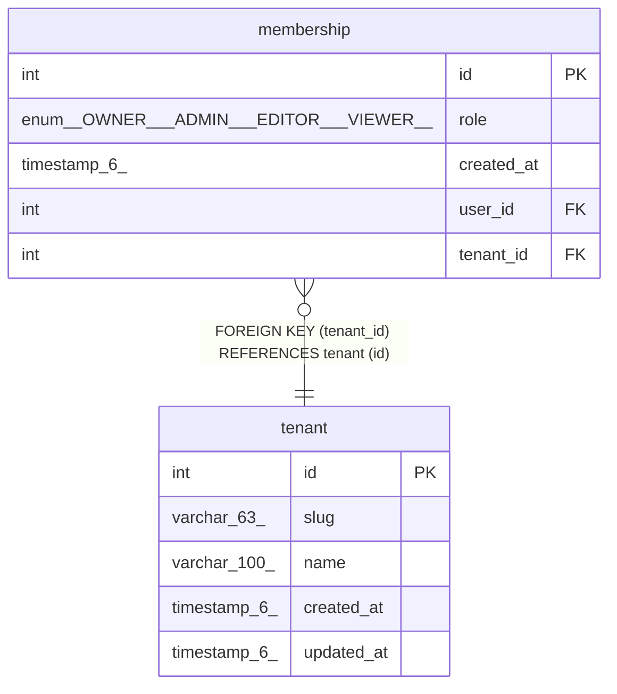

# tenant

## Description

<details>
<summary><strong>Table Definition</strong></summary>

```sql
CREATE TABLE `tenant` (
  `id` int NOT NULL AUTO_INCREMENT,
  `slug` varchar(63) NOT NULL,
  `name` varchar(100) NOT NULL,
  `created_at` timestamp(6) NOT NULL DEFAULT CURRENT_TIMESTAMP(6),
  `updated_at` timestamp(6) NOT NULL DEFAULT CURRENT_TIMESTAMP(6) ON UPDATE CURRENT_TIMESTAMP(6),
  PRIMARY KEY (`id`),
  UNIQUE KEY `IDX_abfd243f7bd832e806d19c5a91` (`slug`)
) ENGINE=InnoDB DEFAULT CHARSET=utf8mb4 COLLATE=utf8mb4_0900_ai_ci
```

</details>

## Columns

| Name | Type | Default | Nullable | Extra Definition | Children | Parents | Comment |
| ---- | ---- | ------- | -------- | ---------------- | -------- | ------- | ------- |
| id | int |  | false | auto_increment | [membership](membership.md) |  |  |
| slug | varchar(63) |  | false |  |  |  |  |
| name | varchar(100) |  | false |  |  |  |  |
| created_at | timestamp(6) | CURRENT_TIMESTAMP(6) | false | DEFAULT_GENERATED |  |  |  |
| updated_at | timestamp(6) | CURRENT_TIMESTAMP(6) | false | DEFAULT_GENERATED on update CURRENT_TIMESTAMP(6) |  |  |  |

## Constraints

| Name | Type | Definition |
| ---- | ---- | ---------- |
| IDX_abfd243f7bd832e806d19c5a91 | UNIQUE | UNIQUE KEY IDX_abfd243f7bd832e806d19c5a91 (slug) |
| PRIMARY | PRIMARY KEY | PRIMARY KEY (id) |

## Indexes

| Name | Definition |
| ---- | ---------- |
| PRIMARY | PRIMARY KEY (id) USING BTREE |
| IDX_abfd243f7bd832e806d19c5a91 | UNIQUE KEY IDX_abfd243f7bd832e806d19c5a91 (slug) USING BTREE |

## Relations



---

> Generated by [tbls](https://github.com/k1LoW/tbls)
