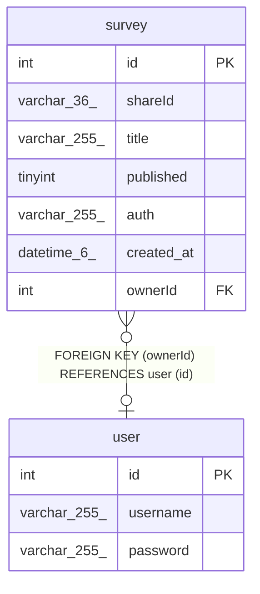

# user

## Description

<details>
<summary><strong>Table Definition</strong></summary>

```sql
CREATE TABLE `user` (
  `id` int NOT NULL AUTO_INCREMENT,
  `username` varchar(255) NOT NULL,
  `password` varchar(255) NOT NULL,
  PRIMARY KEY (`id`),
  UNIQUE KEY `IDX_78a916df40e02a9deb1c4b75ed` (`username`)
) ENGINE=InnoDB AUTO_INCREMENT=[Redacted by tbls] DEFAULT CHARSET=utf8mb4 COLLATE=utf8mb4_0900_ai_ci
```

</details>

## Columns

| Name | Type | Default | Nullable | Extra Definition | Children | Parents | Comment |
| ---- | ---- | ------- | -------- | ---------------- | -------- | ------- | ------- |
| id | int |  | false | auto_increment | [survey](survey.md) |  |  |
| username | varchar(255) |  | false |  |  |  |  |
| password | varchar(255) |  | false |  |  |  |  |

## Constraints

| Name | Type | Definition |
| ---- | ---- | ---------- |
| IDX_78a916df40e02a9deb1c4b75ed | UNIQUE | UNIQUE KEY IDX_78a916df40e02a9deb1c4b75ed (username) |
| PRIMARY | PRIMARY KEY | PRIMARY KEY (id) |

## Indexes

| Name | Definition |
| ---- | ---------- |
| PRIMARY | PRIMARY KEY (id) USING BTREE |
| IDX_78a916df40e02a9deb1c4b75ed | UNIQUE KEY IDX_78a916df40e02a9deb1c4b75ed (username) USING BTREE |

## Relations



---

> Generated by [tbls](https://github.com/k1LoW/tbls)
